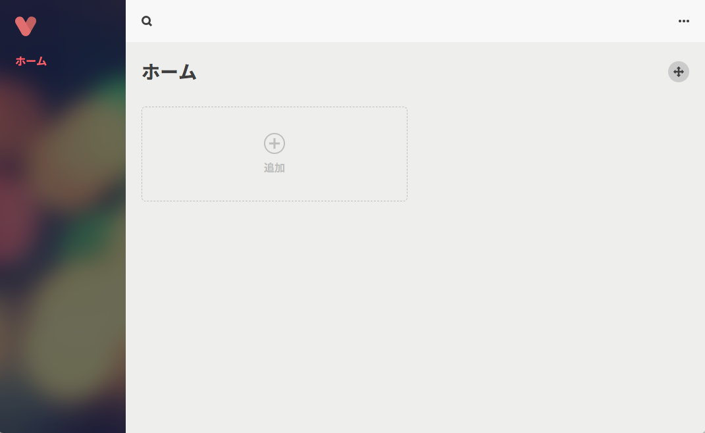
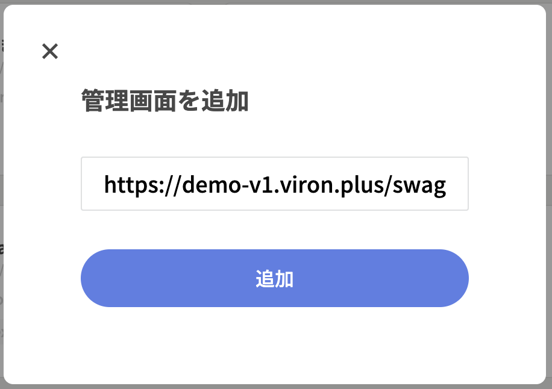
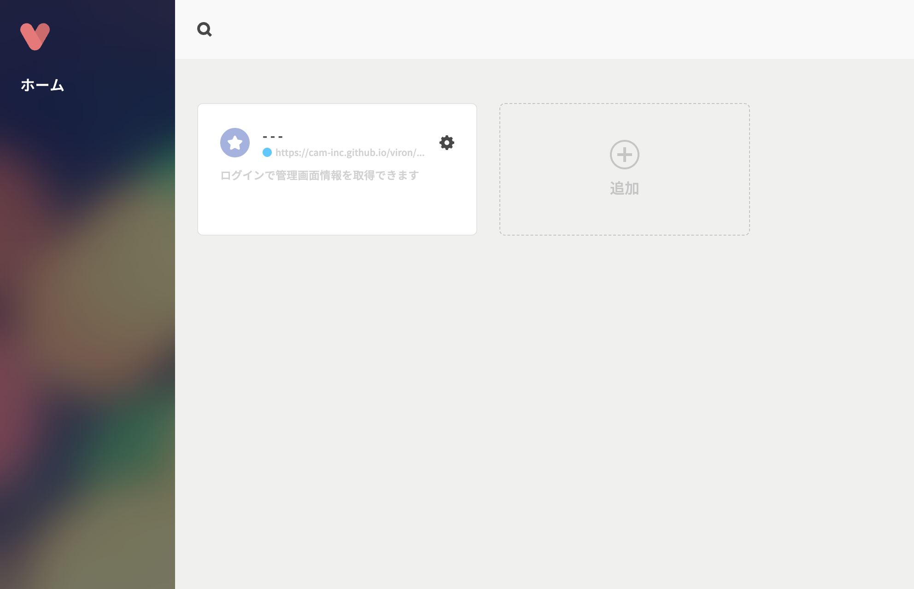
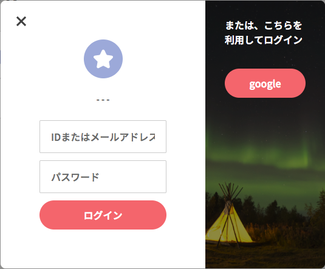
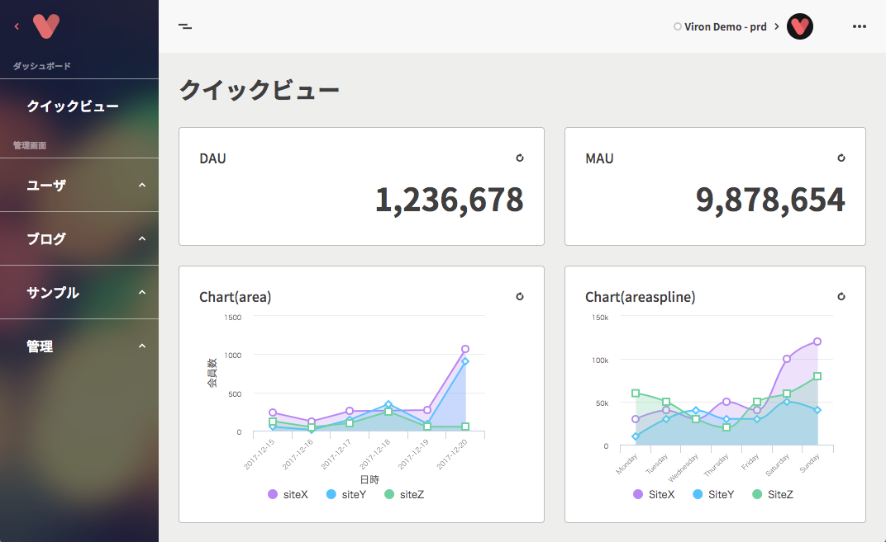
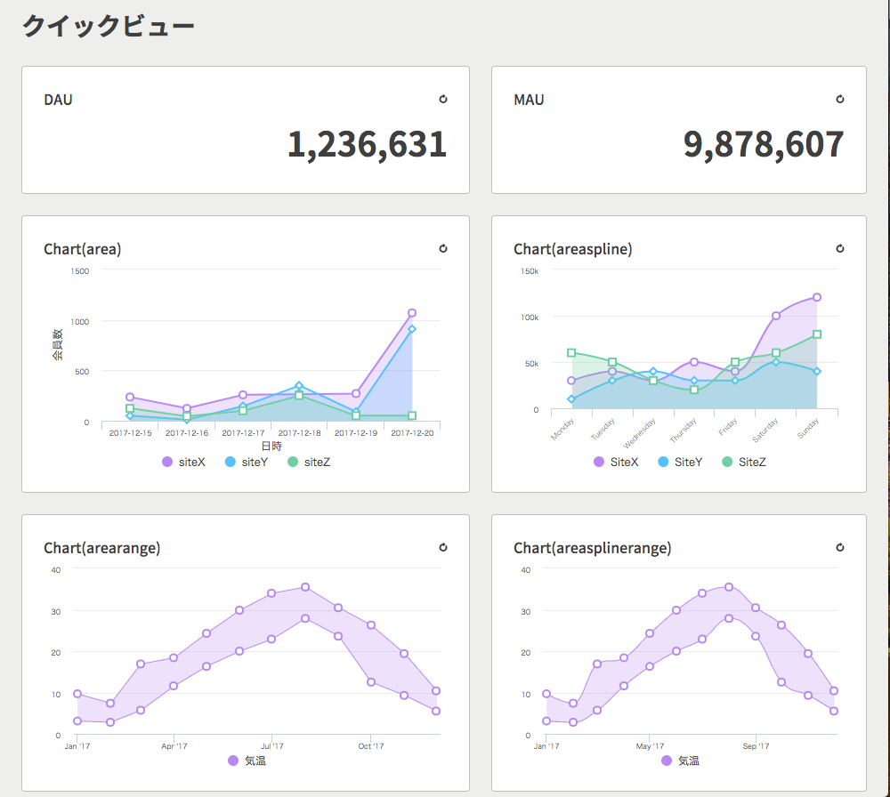
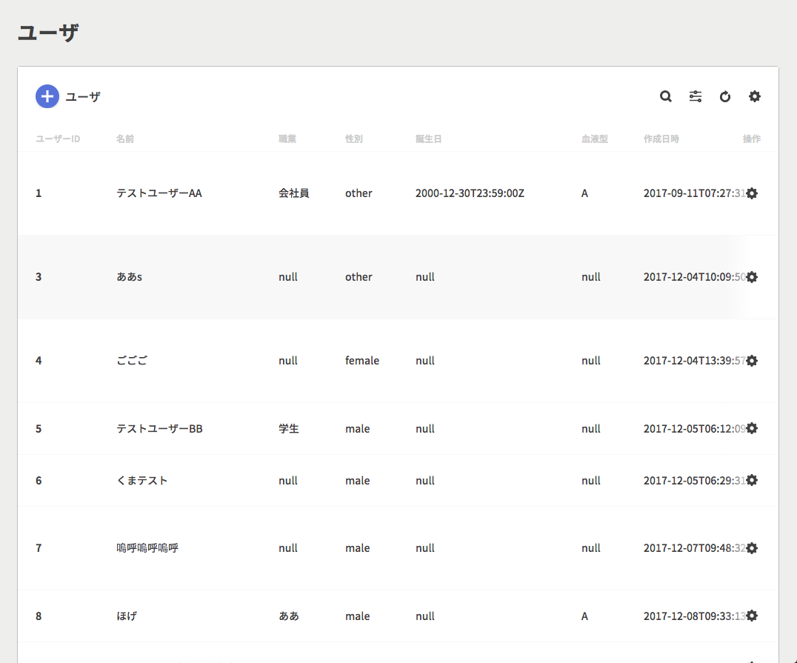

まずはデモ用のAPIサーバーを使ってVIRONに触れてみましょう。

[VIRON](https://cam-inc.github.io/viron/latest) を開いてください。



### Step1: APIサーバーを追加する


をクリックします。


が開いたら、

https://viron.camplat.com/swagger.json

と入力し、追加してください。



カードが追加されれば成功です。

### Step2: ログインする

カードをクリックしてログインフォームを開きます。



ゲストアカウントを使ってログインします。
以下のID/Passwordを入力してログインしてください。

```
ID: visiter@viron.com
Password: Ev4PNxRrls4U
```



この画面が表示されれば成功です。

### Step3: 操作してみる

デモサーバーは大きく「ダッシュボード」と「管理画面」にわかれています。



「ダッシュボード」はシンプルな数値や複雑なグラフのコンポーネントが並んでおり、KPIの確認や日々の実績を比較/評価等に利用されることを想定しています。



「管理画面」はデータのCRUDを提供しています。自由に閲覧/作成/削除等を行ってみてください。
