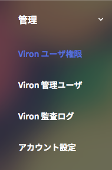
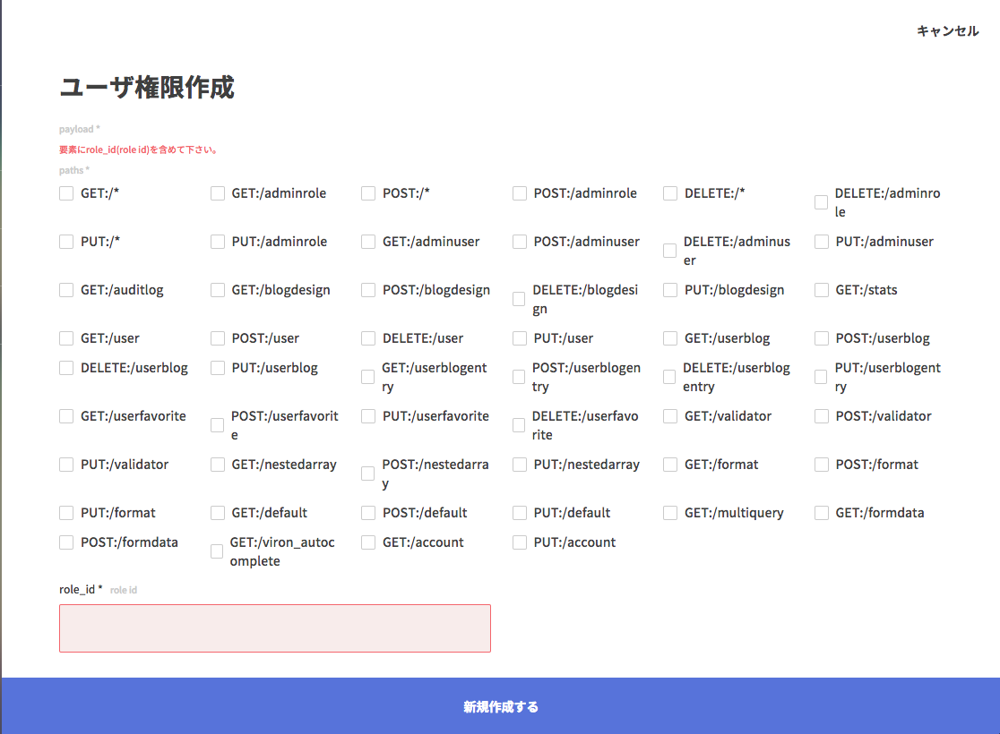
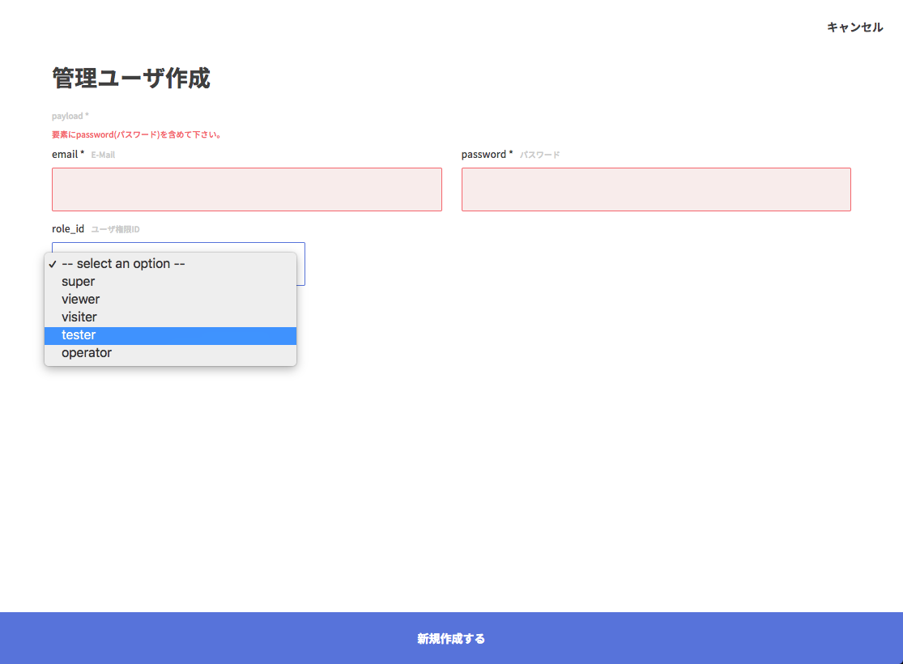

Vironユーザーの権限に関するページです。

### できること

ユーザーに適切な権限を割り当てることでVironでできることを制限することができます。

例えば、参照のみの権限や、Userというリソースのみを更新できる権限、すべてのリソースを操作できる権限、などです。

### 設定方法

#### Step1: 管理メニューから「Viron ユーザー権限」を開く

> デモサーバーではセキュリティ上の理由から管理機能は公開していません。
> ローカルでVironサーバーを起動して確認してみてください。

#### Step2: 新しいユーザー権限を作成する

画像のように、操作(GET/POST/PUT/DELETE)とリソースの組み合わせで設定します。

リソースがワイルドカード(*)になっているものは、全リソースへアクセスできることを表します。

> 権限はリソースに対して設定する仕様のため、例えば `GET:/user/profile` , `GET:/user/address` というAPIが存在している場合、いずれも `GET:/user` を許可することで有効になります。

#### Step3: Vironユーザーに権限を設定する

Vironユーザーの更新(作成)で権限を選択可能です。
