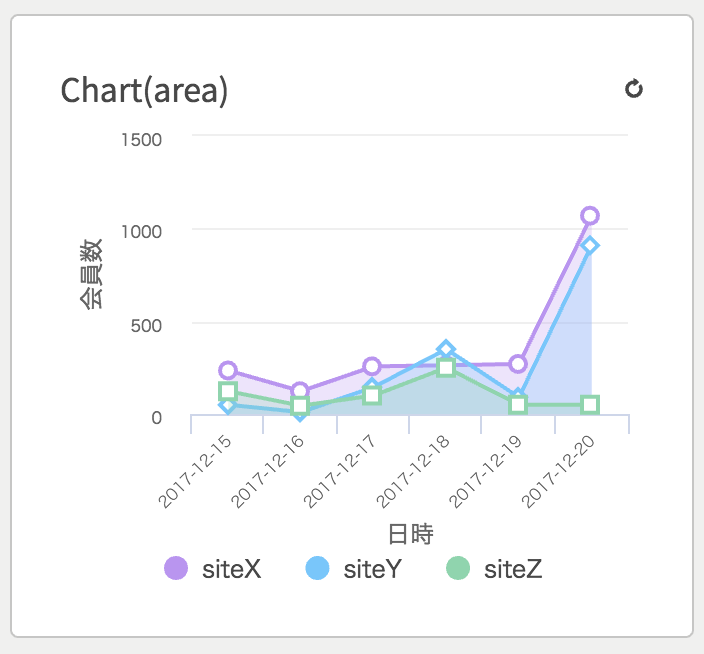

チャートで情報を表示するためのコンポーネントです。

### コンポーネント定義

```json
# GET /viron
# pages[i].components[k]
{
  name: 'DAU',
  style: 'graph-stacked-bar',
  api: {...}
}
```

| key | type | required | default | description |
| ---- | ---- | -------- | ------- | ----------- |
| style | String | yes | '' | `graph-bar`, `graph-scatterplot`, `graph-line`, `graph-horizontal-bar`, `graph-stacked-bar`, `graph-horizontal-stacked-bar` または `graph-stacked-area` を指定して下さい。 |

### レスポンス形式

```json
{
  x: 'date',
  y: 'value',
  color: 'product',
  size: 'value',
  guide: {
    y: {label: 'ユーザー数'},
    x: {label: '日付'},
  },
  data: [
    {date: '2018-01-01', product: 'A', value: 123},
    {date: '2018-01-02', product: 'A', value: 456},
    {date: '2018-01-03', product: 'A', value: 789},
    {date: '2018-01-01', product: 'B', value: 111},
    {date: '2018-01-02', product: 'B', value: 222},
    {date: '2018-01-03', product: 'B', value: 333},
    {date: '2018-01-01', product: 'C', value: 999},
    {date: '2018-01-02', product: 'C', value: 888},
    {date: '2018-01-03', product: 'C', value: 777},
  ],
}
```

| key | type | required | default | description |
| ---- | ---- | -------- | ------- | ----------- |
| x | String | yes | - | x軸のキー |
| y | String | yes | - | y軸のキー |
| color | String | no | - | データの色付けに使用するキーです。 |
| size | String | no | - | データの表示サイズに使用するキーです。 |
| guide.x | Object | no | - | x軸設定 |
| guide.y | Object | no | - | y軸設定 |
| data | Array | yes | - | チャートに反映させるデータ群です。 |

[Taucharts](https://www.taucharts.com/)の仕様に則ります。
