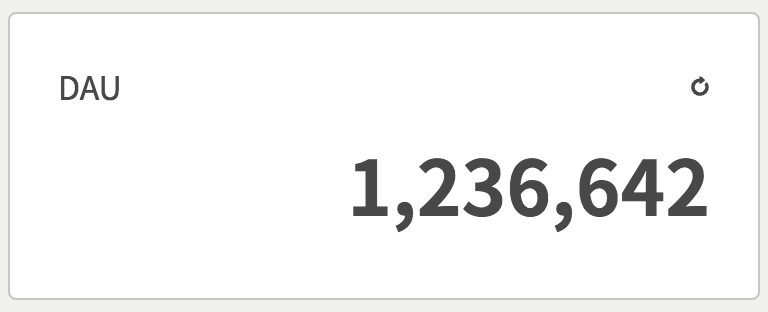

数値情報を表示するためのコンポーネントです。

### コンポーネント定義

```json
# GET /viron
# pages[i].components[k]
{
  name: 'DAU',
  style: 'number',
  api: {...},
  unit: '人'
}
```

| key | type | required | default | description |
| ---- | ---- | -------- | ------- | ----------- |
| style | String | yes | '' | `number`を指定して下さい。 |
| unit | String | no | '' | 単位を表示するために使用されます。 |

### レスポンス形式

```json
{
  value: 12345
}
```

| key | type | required | default | description |
| ---- | ---- | -------- | ------- | ----------- |
| value | Number | yes | 0 | 3桁区切りで出力されます。 |
