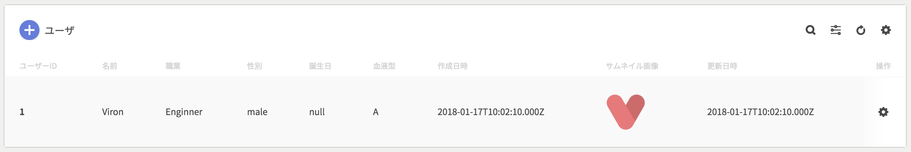

テーブルレイアウトで情報を表示するためのコンポーネントです。

### コンポーネント定義

```json
# GET /viron
# pages[i].components[k]
{
  name: 'Users',
  style: 'table',
  api: {...},
  actions: [
    "/users/upload/csv", "/users/download/csv"
  ],
  pagination: true,
  primary: "id",
  table_labels: ["id", "name", "job", "sex"]

}
```

| key | type | required | default | description |
| ---- | ---- | -------- | ------- | ----------- |
| style | String | yes | '' | `table`を指定して下さい。 |
| actions | Array\<String\> | no | [] | `api`とは別に関連APIが存在する場合はパス名を列挙して下さい。 |
| pagination | Boolean | no | false | ページング機能をONにする場合は`true`を指定して下さい。 |
| primary | String | no | '' | RDBのプライマリーキーを指定して下さい。 |
| table_labels | Array\<String\> | no | [] | テーブル列の並び順を指定します。 |

### 関連アクションについて

テーブルアクションは`api.path`情報から推測されます。例えば`api.path`が`/users`の場合は、

- POST: /users
- PUT: /users
- DELETE: /users
- GET: /users/{primary}
- POST: /users/{primary}
- PUT: /users/{primary}
- DELETE: /users/{primary}

がテーブルアクションとなります。また、`api.path`から推測不能なAPIもテーブルアクションとして認識されるには`actions`を指定して下さい。

### レスポンス形式

```json
[
  {
    id: "xxxx",
    name: "Viron"
  },
  {...},
  {...}
]
```

| key | type | required | default | description |
| ---- | ---- | -------- | ------- | ----------- |
| [i] | Object | yes | {} | オブジェクト内のkey-valueは任意です。 |

また、`pagination`がtrueの場合はレスポンスヘッダーに以下を加える必要があります。

| name | type |
| ---- | ---- |
| X-Pagination-Current-Page | Number |
| X-Pagination-Limit | Number |
| X-Pagination-Total-Pages | Number |

### OAS2.0 ResponseObect

テーブルレイアウト構成はSwaggerの該当APIのResponseObjectを元に構築されます。

```json
# ResponseObject
{
  200: {
    schema: {
      items: {
        properties: {
          id: {
            type: "integer",
            description: "ユーザID",
            format: "int64"
          },
          birthday: {
            type: "string",
            description: "誕生日",
            format: "date-time"
          }
        }
      }
    }
  }
}
```

| key | type | required | default | description |
| ---- | ---- | -------- | ------- | ----------- |
| type | String | yes | '' | JSON Schema仕様に則ります。 |
| description | String | no | '' | 列タイトルに使用されます。 |
| format | String | no | '' | JSON Schema仕様に則ります。 必要に応じてcell表示が切り替わります。|
