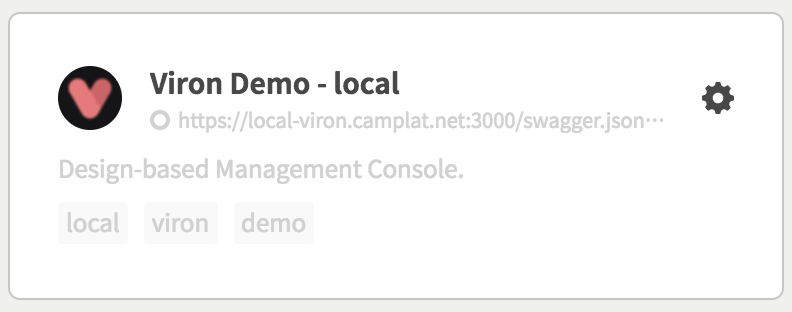

`GET /viron`のレスポンス内容によりエンドポイントカードを編集出来ます。

```json
# GET /viron
{
  name: "Project A - local",
  thumbnail: "https://sample.com/path/to/image.png",
  tags: ["local", "projectA"],
  color: "white"
}
```

| key | type | required | default | description |
| ---- | ---- | -------- | ------- | ----------- |
| name | String | yes | '' | タイトル部に使用されます。 |
| thumbnail | String | no | vironデフォルト画像 | サムネイルとして使用されます。 |
| tags | Array\<String\> | no | [] | タグ群を渡して下さい。 |
| color | String | no | 'blue' | ドットカラーに使用されます。`purple`, `blue`, `green`, `yellow`, `red`, `gray`, `black`もしくは`white`を指定して下さい。 |
