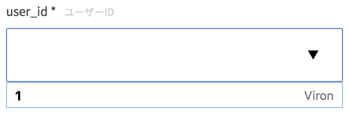

### ParameterObject

```json
{
  type: "string",
  description: "user id",
  required: true,
  x-autocomplete: {
    field: "name",
    path: "/users_autocomplete",
    query: {
      model: "users",
      value: "id"
    }
  }
}
```

| key | type | required | default | description |
| ---- | ---- | -------- | ------- | ----------- |
| type | String | yes | '' | 任意。 |
| description | String | no | '' | 補足説明文です。 |
| required | Boolean | no | false | 入力必須項目か否か。 |
| x-autocomplete | Object | yes | {} | 補完候補リスト取得の際に使用されます。 |

### x-autocomplete

この情報を元に、補完候補リストを取得するリクエストを送信します。
ルールは以下の通りです。

- `path`に対してGETメソッドでリクエストを送信する。
- `query`オブジェクトをGETクエリとして付与する。
- プラスして、`filed`値をキーとしたクエリも付与する。値はフォーム入力値。

上記サンプルの場合、`GET /users_autocomplete?model=users&value=id&name=xxx`(xxxはフォーム入力値)を送信することになります。
