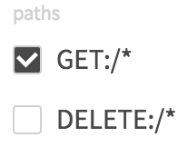

### ParameterObject

```json
{
  type: "boolean",
  description: "title",
  required: true
}
```

| key | type | required | default | description |
| ---- | ---- | -------- | ------- | ----------- |
| type | String | yes | '' | `boolean`を指定して下さい。 |
| description | String | no | '' | 補足説明文です。 |
| required | Boolean | no | false | 入力必須項目か否か。 |
