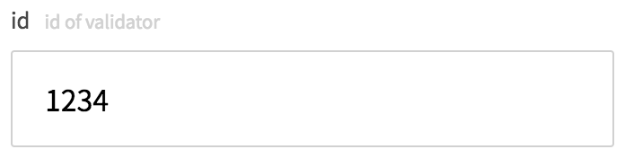

### ParameterObject

```json
{
  type: "number",
  description: "title",
  required: true,
  multipleOf: 5,
  maximum: 100,
  exclusiveMaximum: true,
  minimum: 25,
  exclusiveMinimum: true
}
```

| key | type | required | default | description |
| ---- | ---- | -------- | ------- | ----------- |
| type | String | yes | '' | `number`もしくは`integer`を指定して下さい。 |
| description | String | no | '' | 補足説明文です。 |
| required | Boolean | no | false | 入力必須項目か否か。 |
| multipleOf | Number | no | undefined | [参考](https://tools.ietf.org/html/draft-fge-json-schema-validation-00#section-5.1.1) |
| maximum | Number | no | undefined | [参考](https://tools.ietf.org/html/draft-fge-json-schema-validation-00#section-5.1.2) |
| exclusiveMaximum | Boolean | no | false | [参考](https://tools.ietf.org/html/draft-fge-json-schema-validation-00#section-5.1.2) |
| minimum | Number | no | undefined | [参考](https://tools.ietf.org/html/draft-fge-json-schema-validation-00#section-5.1.3) |
| exclusiveMinimum | Boolean | no | false | [参考](https://tools.ietf.org/html/draft-fge-json-schema-validation-00#section-5.1.3) |
