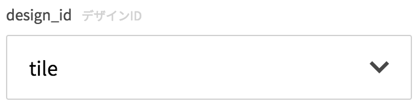

### ParameterObject

```json
{
  type: "string",
  description: "blood type",
  required: true,
  enum: ["A", "B", "AB", "O"]
}
```

| key | type | required | default | description |
| ---- | ---- | -------- | ------- | ----------- |
| type | String | yes | '' | 任意。 |
| description | String | no | '' | 補足説明文です。 |
| required | Boolean | no | false | 入力必須項目か否か。 |
| enum | Array\<any\> | yes | [] | プルダウンリスト項目に使用されます。 |
