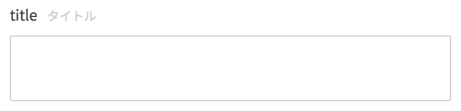

### ParameterObject

```json
{
  type: "string",
  description: "title",
  required: true,
  maxLength: 100,
  minLength: 10,
  pattern: "/^[a-zA-Z]*$/"
}
```

| key | type | required | default | description |
| ---- | ---- | -------- | ------- | ----------- |
| type | String | yes | '' | `string`を指定して下さい。 |
| description | String | no | '' | 補足説明文です。 |
| required | Boolean | no | false | 入力必須項目か否か。 |
| maxLength | Number | no | undefined | [参考](https://tools.ietf.org/html/draft-fge-json-schema-validation-00#section-5.2.1) |
| minLength | Number | no | undefined | [参考](https://tools.ietf.org/html/draft-fge-json-schema-validation-00#section-5.2.2) |
| pattern | String | no | undefined | [参考](https://tools.ietf.org/html/draft-fge-json-schema-validation-00#section-5.2.3) |
