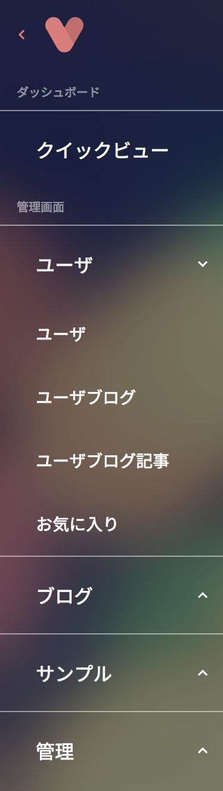

`GET /viron`のレスポンス内容の`pages`値からメニューが生成されます。

```json
# GET /viron
{
  pages: [
    {
      id: "quickview",
      name: "Quick View",
      section: "dashboard",
      sections: [
        { id: "myDashboard", label: "My Dashboard" },
        { id: "myManage", label: "My Manage" }
      ],
      group: "Stats",
      components: [...]
    },
    {...},
    {...}
  ]
}
```

| key | type | required | default | description |
| ---- | ---- | -------- | ------- | ----------- |
| pages | Array\<Object\> | yes | [] | メニュー要素群です。 |
| pages[i].id | String | yes | '' | メニュー要素識別子として使用されます。 |
| pages[i].name | String | yes | '' | メニュー要素名として画面に出力されます。 |
| pages[i].section | String | yes | '' | メニュー要素が属する大カテゴリIDを指定します。`dashboard`もしくは`manage`。大カテゴリを追加する場合は別途`sections`を渡して下さい。|
| pages[i].sections | Array\<Object\> | no | [] | 大カテゴリを追加します。 |
| pages[i].group | String | no | '' | メニュー要素が属する中カテゴリ名を指定します。 |
