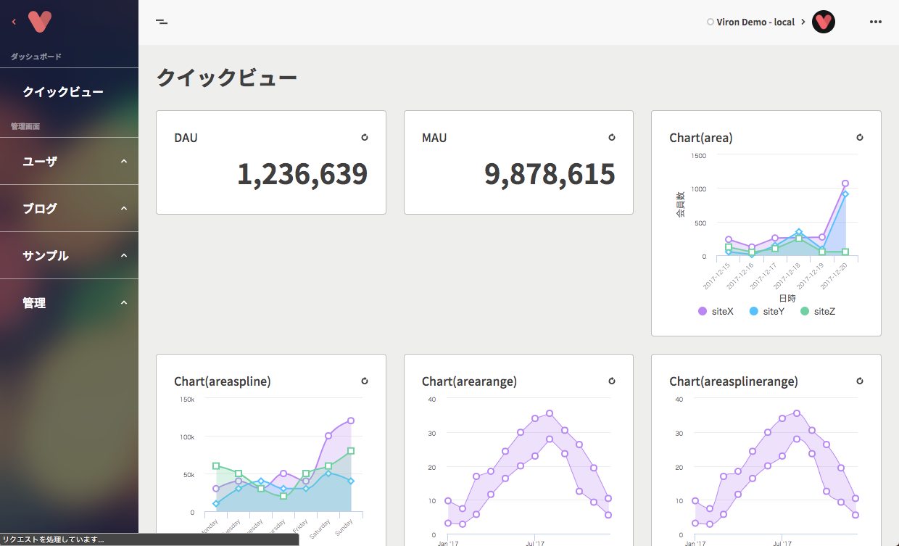

Vironの開発を始めるための準備をしていきます。

わずか3ステップでローカルマシン上でVironを動かすことができます。

### Step1: Vironリポジトリをクローンする

```
$ cd {YOUR_WORKSPACE}
$ git clone git@github.com:cam-inc/viron.git
$ cd viron
```

### Step2: サーバーを起動する

dockerを起動

```
$ npm install
$ npm run dev
```

`HTTPS(8080)` にフロント、 `HTTPS(3000)` にAPIサーバーが起動します。

### Step3: アクセスする

[ローカルViron](https://localhost:8080/) を開きます。

https://localhost:3000/swagger.json

を追加してください。



カードをクリックしてログインフォームを開きます。以下のID/Passwordを入力してログインしてください。

```
ID: user1@example.com
Password: XXXXXXXXXXXX
```

> vironリポジトリには `demo` 以外にもAPIサーバーサンプルとして `example-email`, `example-google` を用意しています。  
それぞれEMail認証、Google認証のみをサポートした必要最小限の構成となっているため、これから開発を始める人の手助けになるはずです。  
`example-email(google)` に移動した後、 `npm run dressup` で起動します。
