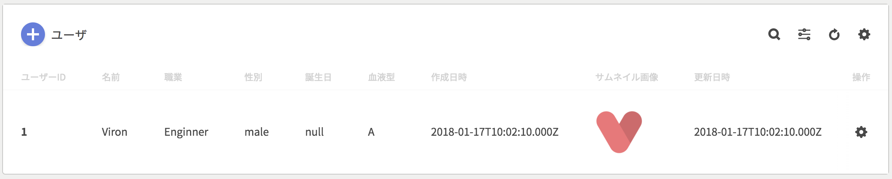
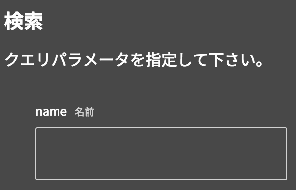
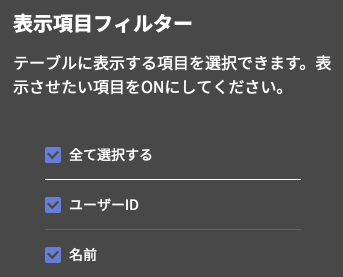
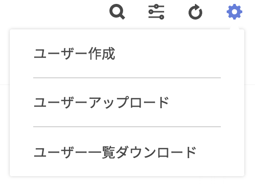

コンポーネント内では、

- 検索
- フィルタリング
- アクションの実行

等を行えます。コンポーネントのデータに応じて各ボタンの表示/非表示が切り替わります。

### 検索する

GETリクエストがクエリパラメータを受け付ける時のみ有効になる機能です。検索クエリ付きでデータを取得するには、コンポーネント内右上に配置されている`検索`ボタンをクリックして下さい。クリック後に現れるモーダル内で、検索クエリに使用する値を入力して下さい。

### フィルタリングする

テーブルデータのみ有効になる機能です。表示データをフィルタリングするには、コンポーネント内右上に配置されている`フィルタリング`ボタンをクリックして下さい。クリック後に現れるモーダル内で、テーブルに表示させたい項目をONにして下さい。

### アクションを実行する

コンポーネントに対するアクションが定義されている時のみ有効になる機能です。コンポーネント下部のボタン群をクリックしてアクションを実行して下さい。
