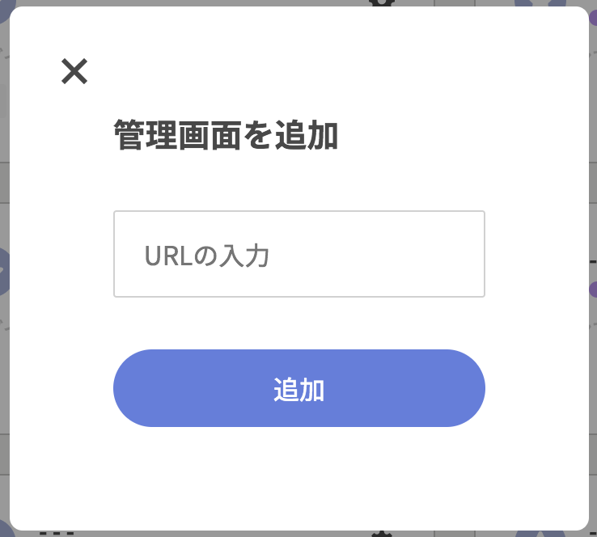
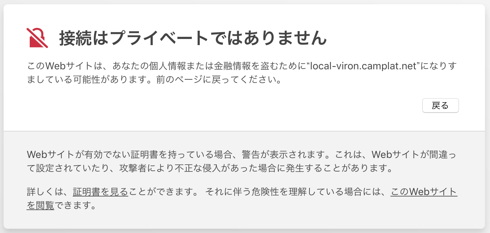

### Step1 - モーダルを開く

`追加`ボタンをクリックして`管理画面を追加`モーダルを開いて下さい。

### Step2 - エンドポイントURLを入力する

エンドポイントURLを入力して下さい。登録済のエンドポイントURLは使用できないので注意して下さい。

### Step3 - 追加する

入力内容に問題が無ければ`追加`ボタンをクリックして下さい。エンドポイント一覧にカードが追加されれば成功です。

---

### FAQ - `追加`ボタンをクリックしたらエラーが発生する

エンドポイントURLが存在しないことが原因かもしれません。まずは、エンドポイントURLが有効であるか確認して下さい。

別の原因として、[自己署名証明書](https://ja.wikipedia.org/wiki/%E8%87%AA%E5%B7%B1%E7%BD%B2%E5%90%8D%E8%A8%BC%E6%98%8E%E6%9B%B8)が使用されていることも考えられます。自己署名証明書を使用している場合、お使いのwebブラウザ上で手動ででセキュリティ設定を行う必要があります。

別タブで開き、URLバーにエンドポイントURLを入力すると以下の様な画面に切り替わります。

使用ブラウザの指示に従い、自己署名証明書の利用を許可して下さい。
