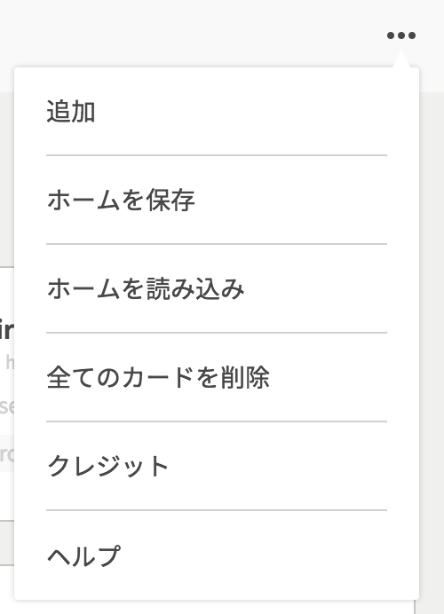

### Step1 - 共有用ファイルをダウンロードする

メニュー内の`ホームを保存`ボタンをクリックすると、現在のエンドポイント群情報の共有用ファイルをダウンロード出来ます。

### Step2 - 共有用ファイルを配置する

ダウンロードした共有用ファイルを、DropboxやGithub上等、チームメンバーがアクセス可能な場所に配置して下さい。共有用ファイルには、環境別のエンドポイント群を含めると良いでしょう。

### Step3 - 共有用ファイルをアップロードする

共有用ファイルをVIRONに反映させるには、メニュー内の`ホームを読み込み`ボタンをクリックして下さい。ファイル選択ダイアログが表示されるので共有用ファイルを選択して下さい。エンドポイント群が追加されるとアップロード成功となります。
